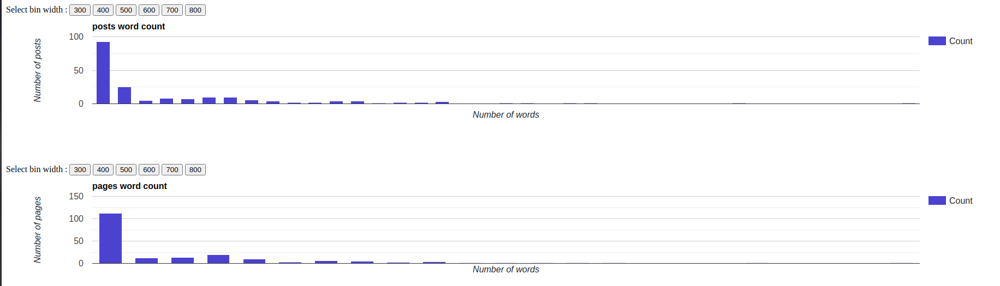

# Google charts API examples

### Interface

### Requirements
  * npm v6.14.4
  * node v12.18.0
  
  Although these are specific versions of npm and node but any fairly updated version of these two should work.

### Tools and Libraries
This is a node.js based application running on express server. All the packages are mentioned in package.json file. And in the next section you can learn how to install all of those libraries.

### Installing the Libraries
Enter the `npm install` command to install all the required packages.

### How to run this app?
Enter the command `npm start` to start the express server and you can check the application by visiting 127.0.0.1: 3000 in your browser.

### Testing
This application uses **mocha** and **chai** for unit testing. More test cases can be added to increase the test coverage of the application. 

Run `npm run test` to start the tesing.
